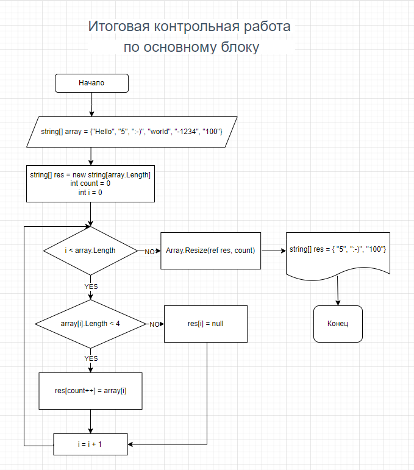

# Описание решения задачи

1. Задаем исходный массив под названием "array", состоящий из следующих строк: "Hello", "5", ":-)", "world", "-1234", "100".

2. Задаем параметры (имя, размер) массива, который должен получиться на выходе, а именно задаем имя "res" и размер, равный размеру исходного массива.

3. Вводим переменную count, которая станет счетчиком количества строк, длина которых меньше 4 символов.

4. С помощью цикла FOR из исходного массива "array" мы отбираем в массив "res" только те строки, длина которых меньше 4 символов, одновременно осуществляя подсчет этих строк.

5. В связи с тем, что размер получившегося массива равен размеру исходного, то в сформированном нами массиве res имеются пустые элементы (после удаления строк, которые не соответствовали условиям задачи). Чтобы избавиться от этих пустых элементов, размер массива редуцируется до значения, которое было получено с помощью переменной count.

6. Вывод исходного и итогового массивов на экран (задача решена)